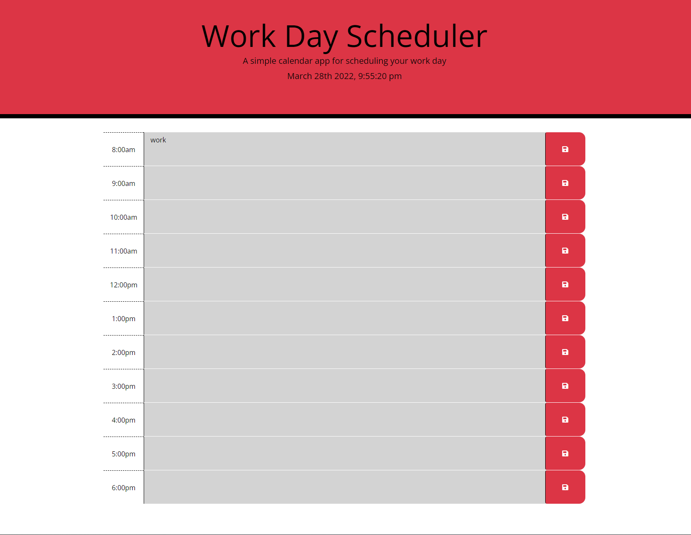

# Work Day Scheduler Starter Code
## A Scheduler that you can use to save important activities and plans for the day; while also being very responsive with the current time related to your scheduled activities.

## User Story

```
AS AN employee with a busy schedule
I WANT to add important events to a daily planner
SO THAT I can manage my time effectively
```

## Acceptance Criteria

```
GIVEN I am using a daily planner to create a schedule
WHEN I open the planner
THEN the current day is displayed at the top of the calendar
WHEN I scroll down
THEN I am presented with time blocks for standard business hours
WHEN I view the time blocks for that day
THEN each time block is color-coded to indicate whether it is in the past, present, or future
WHEN I click into a time block
THEN I can enter an event
WHEN I click the save button for that time block
THEN the text for that event is saved in local storage
WHEN I refresh the page
THEN the saved events persist
```

## Changes made

- added time blocks to the html
- styled each block with bootstrap
- created a start function in the script js file the uses moment js to display current date and time on the the header
- gave the click button functionality by creating a click listener and pairing that to function that saves the activity text to the localStorage
- created a getItem for every time block to that the data is loaded to the screen when saved and refreshed
- then I added a function to check the time and change the colors of the time blocks in relation to the current time vs the block time 

## Screenshot



## Deployed Page

Page published at: https://nbross.github.io/Work-Day-Scheduler/
Git Hub Repo: https://github.com/nbross/Work-Day-Scheduler 